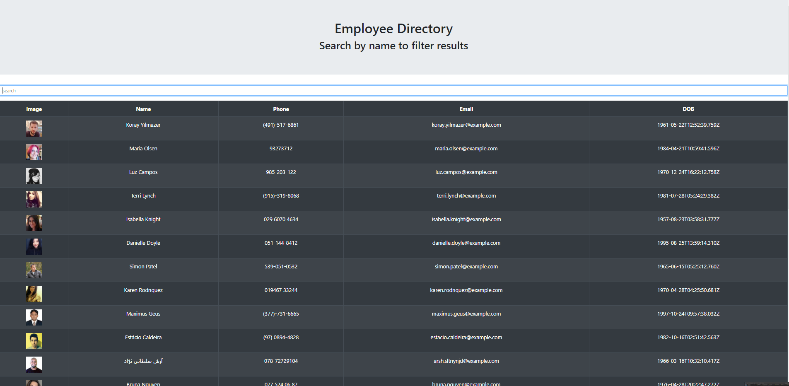

# Employee Directory
 create a employee directory with React. Break up your application's UI into components, manage component state, and respond to user events.
<br>
===========


<br>

## Render api data

```
     <tbody>
                    {/* map through employee array */}
                    {
                        // add data to display to filter data comming in
                        dataToDisplay.map(item => {
                            return (
                                <tr>
                                    {/* use dot notation to render image use img tag to display img */}
                                    <td></img></td>
                                    <td>{item.name.first} {item.name.last}</td>
                                    <td>{item.phone}</td>
                                    <td>{item.email}</td>
                                    <td>{item.dob.date}</td>
                                </tr>
                            )
                        })
                    }

                </tbody>
```
<br>

## Search table by name

```
   if (searchTerm) {
            dataToDisplay = dataToDisplay.filter(item => {
                const jsonString = JSON.stringify(item)
                return (
                    jsonString.includes(searchTerm)
                )
            })
        }
```
<br>

## Build webpage using react UI

```
 function App() {
  const [searchInput, setSearchInput] = useState("")
  console.log(searchInput)
  return (
    // display UI from components
    <div className="App">
      <Jumbo />
      <Search setSearchInput={setSearchInput} />
      <MyTable searchInput={searchInput} />
    </div>
  )
}
```

<br>

## Built With

* [HTML](https://developer.mozilla.org/en-US/docs/Web/HTML)
* [CSS](https://developer.mozilla.org/en-US/docs/Web/CSS)
* [Javascript](https://developer.mozilla.org/en-US/docs/Web/JavaScript)
* [Bootstrap](https://getbootstrap.com/)

## Deployed Link

* [See Live Site](https://jas-f.github.io/employee-directory/)

## License

This project is licensed under the MIT License 

See also the list of [contributors](https://github.com/your/project/contributors) who participated in this project.

## Prerequisites

Git hub,
Git lab,
Git bash,
Visual studio,
Google chrome,
Bootstrap,
JavaScript,
JQuery

## Authors

**Jasmine Franklin C: 301-332-2313 E: jasminer.franklin@gmail** 

- [Link to Portfolio Site](https://jas-f.github.io/portfolio-3.0/)
- [Link to Github](https://github.com/)
- [Link to LinkedIn](https://www.linkedin.com/in/jasmine-franklin-8b08ba121)

<p>&copy; UC Berkeley Extension Bootcamp.</p>